## 类 pyspark.RDD

A Resilient Distributed Dataset (RDD), the basic abstraction in Spark. Represents an immutable, partitioned collection of elements that can be operated on in parallel.

弹性分布式数据集 (RDD),是Spark中的基本抽象。表示可并行操作的不可变的分区集合

### pyspark.RDD类参数实例
class pyspark.RDD(jrdd, ctx, jrdd_deserializer=AutoBatchedSerializer(PickleSerializer()))

### pyspark.RDD函数

-   **aggregate(zeroValue, seqOp, combOp)**    
    Aggregate the elements of each partition, and then the results for all the partitions, using a given combine functions and a neutral “zero value.”
    聚合每个分区的元素, 然后使用给定的组合函数和中性的初始值zeroValue来聚合所有分区的结果。

    seqOp : 每个分区执行的聚合函数对rdd中按分区每个元素y执行此函数, x为上一次的执行结果, 首次计算时使用默认值zeroValue
    combOp: 对每个分区的结果执行的聚合函数执行此函数时, 每个分区的计算结果y执行此函数, x为上一次的执行结果, 首次计算时使用默认值zeroValue

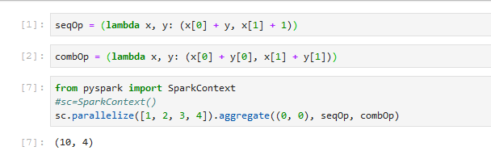

-   **aggregateByKey(zeroValue, seqFunc, combFunc, numPartitions=None, partitionFunc=<function portable_hash>)**  
    Aggregate the values of each key, using given combine functions and a neutral “zero value”. This function can return a different result type, U, than the type of the values in this RDD, V. Thus, we need one operation for merging a V into a U and one operation for merging two U’s, The former operation is used for merging values within a partition, and the latter is used for merging values between partitions. To avoid memory allocation, both of these functions are allowed to modify and return their first argument instead of creating a new U

    聚合每个键的值, 使用给定的组合函数和初始的"Zero value"。此函数可以返回与此RDD中的值类型不同的结果类型u。因此,我们需要一个操作来将V合并到一个u中, 一个操作用于合并两个U的,前者操作用于合并分区中的值, 后者用于合并分区之间的值。为了避免内存分配, 允许这两个函数修改并返回它们的第一个参数, 而不是创建一个新的U

    将reduceByKey和foldByKey都从RDD[(K,V)]映射到RDD[(K,V)];combineByKey(没有aggregateByKey,但它是相同类型的转换)从RDD[(K,V)]到RDD[(K,C)]的转换

-   **cache()**
    Persist this RDD with the default storage level (MEMORY_ONLY).
    使用默认存储级别 (MEMI_ONLY) 保留此 RDD。

-   **checkpoint()**
    Mark this RDD for checkpointing. It will be saved to a file inside the checkpoint directory set with SparkContext.setCheckpointDir() and all references to its parent RDDs will be removed. This function must be called before any job has been executed on this RDD. It is strongly recommended that this RDD is persisted in memory, otherwise saving it on a file will require recomputation。

    将此RDD标记为检查点。它将保存到使用spakcontext. setcingtdtdir()设置的检查点目录中的文件中, 并且将删除对其父Rdd的所有引用。在在此RDD上执行任何作业之前, 必须调用此函数。强烈建议将此RDD保留在内存中, 否则将其保存在文件中需要重新计算。

-   **coalesce(numPartitions, shuffle=False)**
    Return a new RDD that is reduced into numPartitions partitions.
    返回一个新的RDD, 该rdd分区数减少为numpartitions。

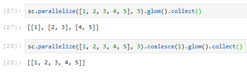

-   **cogroup(other, numPartitions=None)**
    For each key k in self or other, return a resulting RDD that contains a tuple with the list of values for that key in self as well as other
    对于自身或其他中的每个键k, 返回一个生成的RDD, 其中包含一个元组,其中包含自已和其他键的值列表

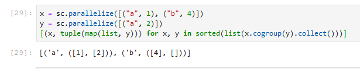

-   **collect()**
    Return a list that contains all of the elements in this RDD

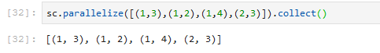

-   **collectAsMap()**
    Return the key-value pairs in this RDD to the master as a dictionar
    以字典形式返回键值对的RDD

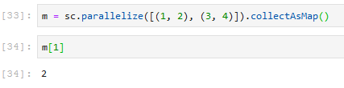

-   **combineByKey(createCombiner, mergeValue, mergeCombiners, numPartitions=None, partitionFunc=<function portable_hash>)**
    Generic function to combine the elements for each key using a custom set of aggregation functions
    Turns an RDD[(K, V)] into a result of type RDD[(K, C)], for a “combined type” C
    Users provide three functions:
        createCombiner, which turns a V into a C (e.g., creates a one-element list)
        mergeValue, to merge a V into a C (e.g., adds it to the end of a list)
        mergeCombiners, to combine two C’s into a single one (e.g., merges the lists)

-   **count()**
    Return the number of elements in this RDD
    计算RDD中的元素个数

-   **countByKey()**
    Count the number of elements for each key, and return the result to the master as a dictionary.
    计算每个键的元素数, 并将结果作为字典返回到主项。
    
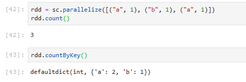

-   **countByValue()**
    Return the count of each unique value in this RDD as a dictionary of (value, count) pairs

-   **distinct(numPartitions=None)**
    Return a new RDD containing the distinct elements in this RDD   
    返回包含此 RDD 中的不同元素的新 RDD

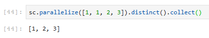

-   **filter(f)**
    Return a new RDD containing only the elements that satisfy a predicate.
    返回包好符合过滤条件的元素的RDD

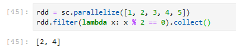

-   **flatMap(f, preservesPartitioning=False)**
    Return a new RDD by first applying a function to all elements of this RDD, and then flattening the results
    返回所有的符合过滤条件的元素，并且将数据展开

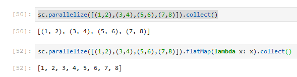

-   **flatMapValues(f)**
    Pass each value in the key-value pair RDD through a flatMap function without changing the keys; this also retains the original RDD’s partitioning
    将每个值和对应的键生成一个单一的键值对, 而不更改键;这也保留了原来的 RDD 分区
    
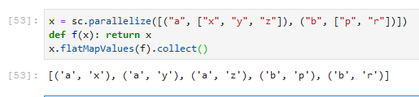

-   **fold(zeroValue, op)**
    Aggregate the elements of each partition, and then the results for all the partitions, using a given associative function and a neutral “zero value.”
    在每个分区中进行汇总元素数据，后使用关联的函数和初始zero value来聚合所有分区中的数据

-   **foreach(f)**
    Applies a function to all elements of this RDD.
    对于RDD中每个元素应用函数f

~~~python
def f(x): print(x)
sc.parallelize([1, 2, 3, 4, 5]).foreach(f)
~~~

-   **fullOuterJoin**
    Perform a right outer join of self and other 执行右外连接
    For each element (k, v) in self, the resulting RDD will either contain all pairs (k, (v, w)) for w in other, or the pair (k, (v, None)) if no elements in other have key k.Similarly, for each element (k, w) in other, the resulting RDD will either contain all pairs (k, (v, w)) for v in self, or the pair (k, (None, w)) if no elements in self have key k
    对于每个元素(k, v)在self上,生成的RDD将包含其他中的w的所有对(k, (v, w)), 或者在other中没有键k的对(k, v, none))),同样,对于other中的元素(k, w),生成的RDD将包含所有对(k), (v, w)) 为v在self中, 或对(k,(none, w))如果在self中没有k键

~~~python
>>> x = sc.parallelize([("a", 1), ("b", 4)])
>>> y = sc.parallelize([("a", 2), ("c", 8)])
>>> sorted(x.fullOuterJoin(y).collect())
[('a', (1, 2)), ('b', (4, None)), ('c', (None, 8))]
~~~

-   **getCheckpointFile()**
    Gets the name of the file to which this RDD was checkpointed

-   **getNumPartitions()**
    Returns the number of partitions in RDD

-   **getStorageLevel()**
    Get the RDD’s current storage level

-   **glom()**
    Return an RDD created by coalescing all elements within each partition into a list
    返回通过将每个分区中的所有元素合并到列表中而创建的RDD

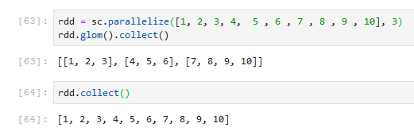

-   **groupBy(f, numPartitions=None, partitionFunc=<function portable_hash>)**
    Return an RDD of grouped items. 返回汇总值     
~~~python
>>> rdd = sc.parallelize([1, 1, 2, 3, 5, 8])
>>> result = rdd.groupBy(lambda x: x % 2).collect()
>>> sorted([(x, sorted(y)) for (x, y) in result])
[(0, [2, 8]), (1, [1, 1, 3, 5])]
~~~

-   **groupByKey(numPartitions=None, partitionFunc=<function portable_hash>)**
    Group the values for each key in the RDD into a single sequence. Hash-partitions the resulting RDD with numPartitions partitions
    将 RDD 中每个键的值分组为一个序列。使用数字分区对生成的 RDD 进行哈希分区   
~~~python
>>> rdd = sc.parallelize([("a", 1), ("b", 1), ("a", 1)])
>>> sorted(rdd.groupByKey().mapValues(len).collect())
[('a', 2), ('b', 1)]
>>> sorted(rdd.groupByKey().mapValues(list).collect())
[('a', [1, 1]), ('b', [1])]
~~~

-   **intersection(other) 计算两个RDD交集**
    Return the intersection of this RDD and another one. The output will not contain any duplicate elements, even if the input RDDs did
    返回此RDD和另一个的交集。输出将不包含任何重复的元素
~~~python
>>> rdd1 = sc.parallelize([1, 10, 2, 3, 4, 5])
>>> rdd2 = sc.parallelize([1, 6, 2, 3, 7, 8])
>>> rdd1.intersection(rdd2).collect()
[1, 2, 3]
~~~

-   **join(other, numPartitions=None)**
    Return an RDD containing all pairs of elements with matching keys in self and other.
    Each pair of elements will be returned as a (k, (v1, v2)) tuple, where (k, v1) is in self and (k, v2) is in other.
    Performs a hash join across the cluster

    返回包含在两个RDD中匹配键的所有元素对的RDD。
    每一对元素将作为(k, (v1, v2))元组返回, 其中(k,v1)在self中, (k, v2)在other中。
~~~python
>>> x = sc.parallelize([("a", 1), ("b", 4)])
>>> y = sc.parallelize([("a", 2), ("a", 3)])
>>> sorted(x.join(y).collect())
[('a', (1, 2)), ('a', (1, 3))]
~~~

-   **leftOuterJoin(other, numPartitions=None)**

-   **map(f, preservesPartitioning=False)**
    Return a new RDD by applying a function to each element of this RDD.
    通过将函数应用于此 RDD 的每个元素, 返回新的 RDD。
~~~python
>>> rdd = sc.parallelize(["b", "a", "c"])
>>> sorted(rdd.map(lambda x: (x, 1)).collect())
[('a', 1), ('b', 1), ('c', 1)]
~~~

-   **mapPartitions(f, preservesPartitioning=False)**
    Return a new RDD by applying a function to each partition of this RDD
~~~python
>>> rdd = sc.parallelize([1, 2, 3, 4], 2)
>>> def f(iterator): yield sum(iterator)
>>> rdd.mapPartitions(f).collect()
[3, 7]
~~~

-   **persist(storageLevel=StorageLevel(False, True, False, False, 1))**
    Set this RDD’s storage level to persist its values across operations after the first time it is computed. This can only be used to assign a new storage level if the RDD does not have a storage level set yet. If no storage level is specified defaults to (MEMORY_ONLY)      
    将此RDD的存储级别设置为在第一次计算后在操作中保留其值。这只能用于分配新的存储级别, 如果RDD还没有存储级别集。如果未指定存储级别, 则默认为 (MEMORY_ONLY)    
~~~python
>>> rdd = sc.parallelize(["b", "a", "c"])
>>> rdd.persist().is_cached
True
~~~

-   **unpersist()**
    Mark the RDD as non-persistent, and remove all blocks for it from memory and disk.将RDD标记为非持久性,并从内存和磁盘中删除它的所有块.

-   **reduce(f)**
    Reduces the elements of this RDD using the specified commutative and associative binary operator. Currently reduces partitions locally     
    使用指定的交换和关联二进制运算符减少此 RDD 的元素。当前在本地减少分区   
~~~python
>>> from operator import add
>>> sc.parallelize([1, 2, 3, 4, 5]).reduce(add)
15
>>> sc.parallelize((2 for _ in range(10))).map(lambda x: 1).cache().reduce(add)
10
>>> sc.parallelize([]).reduce(add)
Traceback (most recent call last):
    ...
ValueError: Can not reduce() empty RDD
~~~

-   **saveAsHadoopDataset(conf, keyConverter=None, valueConverter=None)**
-   **saveAsHadoopFile(path,outputFormatClass,keyClass=None,valueClass=None,keyConverter=None,valueConverter=None,conf=None, compressionCodecClass=None)**
-   **saveAsNewAPIHadoopFile(path, outputFormatClass, keyClass=None, valueClass=None, keyConverter=None, valueConverter=None, conf=None)**
-   **saveAsPickleFile(path, batchSize=10)**
-   **saveAsSequenceFile(path, compressionCodecClass=None)**
-   **saveAsTextFile(path, compressionCodecClass=None)**
-   **max(key=None)**
-   **mean()**
-   **min(key=None)**
-   **stdev()**
-   **sum()**
-   **top(num, key=None)**