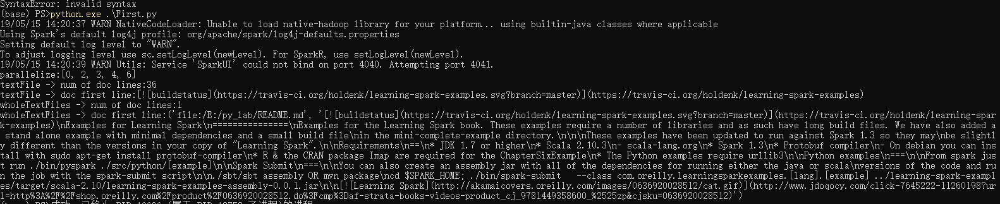

## 主要函数

主要是这三个函数：
**parallelize ;  textFile  ; wholetextFiles**

其他的针对特定格式的文件：
* binaryFiles(path, minPartitions=None)
* hadoopFile(path, inputFormatClass, keyClass, valueClass, keyConverter=None, valueConverter=None, conf=None, batchSize=0)
* pickleFile(name, minPartitions=None)
* sequenceFile(path, keyClass=None, valueClass=None, keyConverter=None, valueConverter=None, minSplits=None, batchSize=0)[source]

>> 装载数据的目的为了生成RDD。

做任何Spark开发前，都先要对spark核心类SparkContext有一个清晰的认识,以下链接来自spark官网的说明。
[SparkContext相关说明](core-class-pysaprk/pyspark.SparkContext.md)                    

Spakcontext表示与Spark群集的连接,可用于在该群集上创建RDD和广播变量。所以在进行任何Spark操作前都是需要SparkContext对象

class pyspark.SparkContext(master=None, appName=None, sparkHome=None, pyFiles=None, environment=None, batchSize=0, serializer=PickleSerializer(), conf=None, gateway=None, jsc=None, profiler_cls=<class 'pyspark.profiler.BasicProfiler'>)
-   Master - 它是连接到的集群的URL。
-   appName - 工作名称。
-   sparkHome - Spark安装目录。
-   pyFiles - 要发送到集群并添加到PYTHONPATH的.zip或.py文件。
-   environment - 工作节点环境变量。
-   batchSize - 表示为单个Java对象的Python对象的数量。设置1以禁用批处理,设置0以根据对象大小自动选择批处理大小，或设置为-1以使用无限批处理大小。
-   serializer - RDD序列化器。
-   conf - L {SparkConf}的一个对象，用于设置所有Spark属性。
-   gateway- 使用现有网关和JVM，否则初始化新JVM。
-   JSC - JavaSparkContext实例。
-   profiler_cls - 用于进行性能分析的一类自定义Profiler（默认为pyspark.profiler.BasicProfiler).

>>> SparkContext是spark的主要切入点，由于RDD是主要的API，通过sparkcontext来创建和操作RDD ; 对于其他不同的处理场景使用不同的Context。如SqlContext,StreamingContext,hiveContext.这种多个Context的情况在Spark 1.0时代出现。在Spark 2.0中，引入SparkSession作为DataSet和DataFrame API的切入点，SparkSession封装了SparkConf、SparkContext和SQLContext。为了向后兼容，SQLContext和HiveContext也被保存下来
SparkSession实质上是SQLContext和HiveContext的组合（未来可能还会加上StreamingContext），所以在SQLContext和HiveContext上可用的API在SparkSession上同样是可以使用的。SparkSession内部封装了sparkContext，所以计算实际上是由sparkContext完成的。

### **parallelize(c,numSlices=None)**

~~~python
>>> sc.parallelize([0, 2, 3, 4, 6], 5).glom().collect()
[[0], [2], [3], [4], [6]]
>>> sc.parallelize(xrange(0, 6, 2), 5).glom().collect()
[[], [0], [], [2], [4]]
~~~

**除了开发原型和测试时，这种方式用得并不多，毕竟这种方式需要把整个数据集先放在一台机器的内存中,针对大数据量无法处理**

### textFile(name, minPartitions=None, use_unicode=True)

从外部读完数据，可以在不同的数据源上进行。

~~~python
>>> path = os.path.join(tempdir, "sample-text.txt")
>>> with open(path, "w") as testFile:
...    _ = testFile.write("Hello world!")
>>> textFile = sc.textFile(path)
>>> textFile.collect()
['Hello world!']
~~~

**用于读取不同外部数据源的数据,针对不同的数据机构；textFile是主要的获取数据的方法**

### wholeTextFiles(path, minPartitions=None, use_unicode=True)

同时处理整个文件。如果文件足够小，那么可以使用SparkContext.wholeTextFiles()方法，该方法会返回一个pair RDD，其中键是输入文件的文件名

~~~python
>>> dirPath = os.path.join(tempdir, "files")
>>> os.mkdir(dirPath)
>>> with open(os.path.join(dirPath, "1.txt"), "w") as file1:
...    _ = file1.write("1")
>>> with open(os.path.join(dirPath, "2.txt"), "w") as file2:
...    _ = file2.write("2")
>>> textFiles = sc.wholeTextFiles(dirPath)
>>> sorted(textFiles.collect())
[('.../1.txt', '1'), ('.../2.txt', '2')]
~~~

**用于读取文件内容，进行一次处理;针对小文件可以进行这样的处理,一次性读取**

## 总结

主要介绍了数据读取的3种方法,读取的后生成RDD,就可以进行对RDD进行操作。在下一章种进行对RDD的基础操作进行说明。

脚本示例
~~~python
from pyspark import SparkContext

def test_parallelize(sc):
	"""
	对parallelize使用
	"""
	print('{}{}'.format('parallelize:',sc.parallelize([0, 2, 3, 4, 6], 5).collect()))

def test_textFile(sc):
	"""
	对textFile使用
	"""
	lines=sc.textFile('E:\py_lab\README.md')
	print('{}{}'.format('textFile -> num of doc lines:',lines.count()))
	print('{}{}'.format('textFile -> doc first line:',lines.first()))

def test_wholeTextFiles(sc):
	"""
	对wholeTextFiles使用
	"""
	lines=sc.wholeTextFiles('E:\py_lab\README.md')
	print('{}{}'.format('wholeTextFiles -> num of doc lines:',lines.count()) )
	print('{}{}'.format('wholeTextFiles -> doc first line:',lines.first()) )
	
if __name__=='__main__': 
	sc = SparkContext()
	test_parallelize(sc)
	test_textFile(sc)
	test_wholeTextFiles(sc)
~~~

