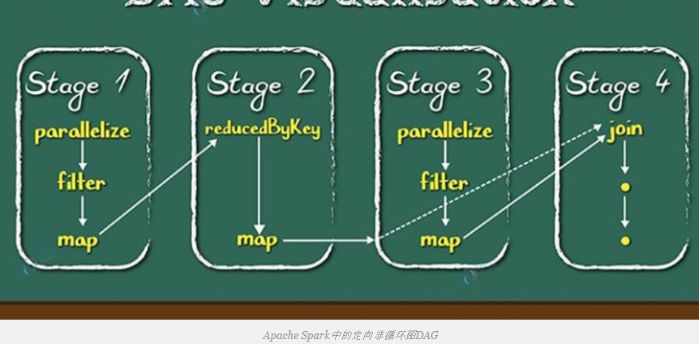
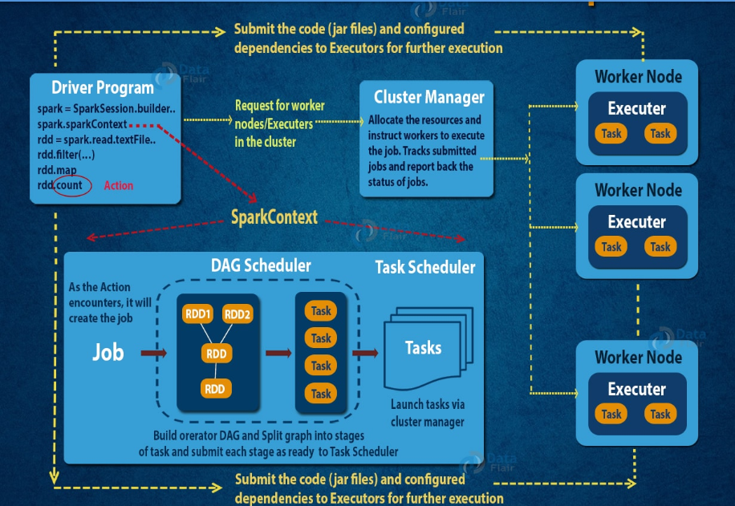

## Spark DAG

定向非循环图DAG(Directed Acyclic Graph)
DAG中的Apache Saprk是一组顶点和边，其中顶点代表RDDS和边缘代表上RDD施加操作。在Spark DAG中，每个边缘从序列中的较早到较晚指示。在调用Action时，创建的DAG提交给DAG Scheduler，后者进一步将图形拆分为任务的各个阶段。

它是MapReduce模型的严格概括。与其他系统（如MapReduce）相比，DAG操作可以实现更好的全局优化。DAG的图片在更复杂的工作中变得清晰。

Hadoop MapReduce 的局限性成为在Spark中引入DAG的关键点。通过MapReduce计算分三步：
-   从HDFS读取数据。
-   然后应用Map和Reduce操作。
-   计算结果将写回HDFS。
-   每个MapReduce操作都是相互独立的，HADOOP不知道接下来会有哪些Map减少。
    有时，对于某些迭代，在两个map-reduce作业之间读取和写回立即结果是无关紧要的。在这种情况下，稳定存储（HDFS）或磁盘存储器中的存储器被浪费。

在多步骤中，直到完成上一个作业，所有作业从一开始就阻止。结果，复杂的计算可能需要很长的时间和小的数据量。

在Spark中，形成连续计算阶段的DAG（有向无环图）。通过这种方式，我们优化了执行计划，例如最小化混乱数据。相比之下，它通过调整每个MapReduce步骤在MapReduce中手动完成

### DAG如何在Spark中运行

-   解释器是第一层，使用Scala解释器，Spark通过一些修改来解释代码。
-   在Spark控制台中输入代码时，Spark会创建一个运算符图。
-   当我们 在高级别上调用Spark RDD上的  Action时，Spark会将运算符图形提交给DAG调度程序。
-   将运算符划分为DAG调度程序中的任务阶段。阶段包含基于输入数据分区的任务。DAG调度程序将运营商连接在一起。例如，地图运营商在一个阶段中进行计划。
-   这些阶段将传递给任务计划程序。它通过集群管理器启动任务。任务调度程序不知道阶段的依赖关系。
-   该slave上执行任务。

