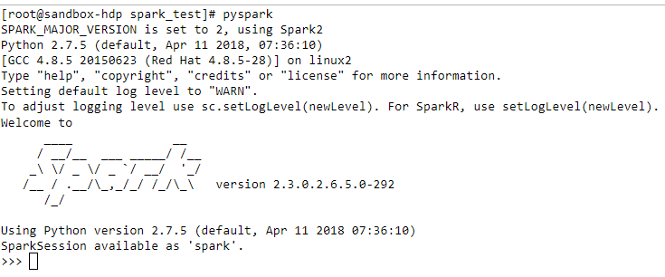

## Spark RDD 编程模型

Spark 中的 RDD 就是一个不可变的分布式对象集合。每个 RDD 都被分为多个分区，这些分区运行在集群中的不同节点上。RDD可以包含 Python、Java、Scala中任意类型的对象，甚至可以包含用户自定义的对象

用户可以使用两种方法创建 RDD： 读取一个外部数据集，或在驱动器程序里分发驱动器程序中的对象集合（比如 list 和 set）
以下使用pyspark进行说明：

-   开启pyspark shell
-   l

-   在Python中使用textFile()创建一个字符串的RDD
~~~python
lines=sc.textFile(README.md)
~~~

创建出来后，RDD支持两种类型的操作：转化操作transformation）和行动操作(action),
 转化操作会由一个RDD生成一个新的RDD,如下的filter函数

-   调用转化操作filter()
~~~python
pythonlines=lines.filter(lambda line:"python" in line)
~~~

对于action操作对RDD计算出一个结果，并把结果返回到驱动器程序中，或把结果存储到外部存储系统（如 HDFS）中
如下的first()操作

-   调用first()行动操作
~~~python
pythonlines.first()
~~~

调用结果如下：
~~~shell
Using Python version 2.7.5 (default, Apr 11 2018 07:36:10)
SparkSession available as 'spark'.
>>> lines=sc.textFile("README.md")                                                                   
>>> pythonlines=lines.filter(lambda line:"python" in line)          
>>> pythonlines.first()
u'From spark just run ./bin/pyspark ./src/python/[example]'
~~~

>>> spark计算RDD时是lazy模式(延迟计算)，一旦 Spark 了解了完整的转化操作链之后，它就可以只计算求结果时真正需要的数据,所以这也是上述的python代码中，只显示出一次结果的原因。

>>> 默认情况下，Spark的RDD会在你每次对它们进行行动操作时重新计算,如果想在多个行动操作中重用同一个RDD，可以使用RDD.persist()让Spark把这个RDD缓存下来,可以将数据保存到内存或者磁盘。

-   把RDD持久化到内存中
~~~python
>>> pythonlines.persist                                                                                                                         <bound method PipelinedRDD.persist of PythonRDD[4] at RDD at PythonRDD.scala:48>
~~~

## 总的来说，每个Spark程序或shell会话都按如下方式工作。

-   从外部数据创建出输入 RDD。
-   使用诸如 filter() 这样的转化操作对RDD进行转化，以定义新的 RDD。
-   告诉 Spark 对需要被重用的中间结果RDD执行persist() 操作。
-   使用行动操作（例如 count()和first()等）来触发一次并行计算，Spark 会对计算进行优化后再执行。
