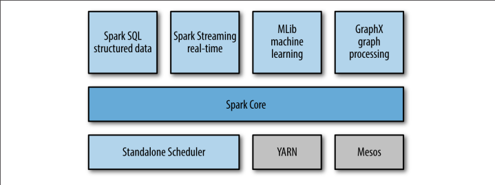

## Spark主要核心组件

## Spark Core

Spark Core实现了Spark的基本功能，包含任务调度、内存管理、错误恢复、与存储系统,交互等模块。
Spark Core 中还包含了对弹性分布式数据集（resilient distributed dataset，简称 RDD）的API定义。 
RDD 表示分布在多个计算节点上可以并行操作的元素集合，是Spark 主要的编程抽象。 Spark Core 提供了创建和操作这些集合的多个API

## Spark SQL
Spark SQL 是Spark用来操作结构化数据的程序包。通过 Spark SQL，可以使用SQL或者Apache Hive版本的SQL方言（HQL）来查询数据。 
Spark SQL 支持多种数据源，比如Hive表、Parquet以及JSON等。除了为Spark提供了一个 SQL接口，Spark SQL 还支
持开发者将 SQL 和传统的 RDD 编程的数据操作方式相结合，不论是使用 Python、 Java还是 Scala，开发者都可以在单个的应用中同时使用 SQL 和复杂的数据分析。
通过与 Spark所提供的丰富的计算环境进行如此紧密的结合,Spark SQL得以从其他开源数据仓库工具中脱颖而出。Spark SQL是在Spark1.0中被引入的。

## Spark Streaming
Spark Streaming 是 Spark 提供的对实时数据进行流式计算的组件。比如生产环境中的网页服务器日志， 或是网络服务中用户提交的状态更新组成的消息队列，都是数据流。 
Spark Streaming 提供了用来操作数据流的 API， 并且与 Spark Core 中的 RDD API 高度对应。这样一来，程序员编写应用时的学习门槛就得以降低，不论是操作内存或硬盘中的数据，还是操作实时数据流， 程序员都更能应对自如。从底层设计来看， Spark Streaming 支持与Spark Core 同级别的容错性、吞吐量以及可伸缩性

## MLlib
Spark 中还包含一个提供常见的机器学习（ML）功能的程序库，叫作 MLlib。 MLlib 提供了很多种机器学习算法， 包括分类、回归、聚类、协同过滤等，还提供了模型评估、数据导入等额外的支持功能。 MLlib 还提供了一些更底层的机器学习原语，包括一个通用的梯度下降优化算法。所有这些方法都被设计为可以在集群上轻松伸缩的架构

## GraphX
GraphX 是用来操作图（比如社交网络的朋友关系图）的程序库，可以进行并行的图计算。与Spark Streaming和Spark SQL类似， GraphX 也扩展了 Spark 的 RDD API，能用来创建一个顶点和边都包含任意属性的有向图。GraphX还支持针对图的各种操作（比如进行图GraphX 是用来操作图（比如社交网络的朋友关系图）的程序库，可以进行并行的图计算。与 Spark Streaming 和 Spark SQL 类似， GraphX 也扩展了 Spark 的 RDD API，能用来创建一个顶点和边都包含任意属性的有向图。   