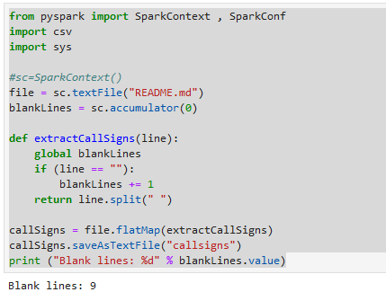
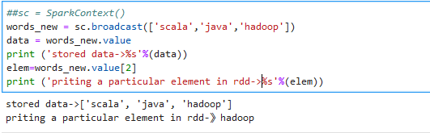

### 共享变量-累加器（accumulator）与广播变量（broadcast variable）
对于并行处理，Apache Spark使用共享变量。当驱动程序将任务发送给集群上的执行者时，集群中的每个节点上都有一个共享变量的副本，这样就可以用于执行任务了

### accumulator

提供了**将工作节点中的值聚合到驱动器程序中**的简单语法。累加器的一个常见用途是在调试时对作业执行过程中的事件进行计数。

-   Python中累加空行
~~~python
from pyspark import SparkContext , SparkConf
import csv
import sys
#sc=SparkContext()
file = sc.textFile("README.md")
blankLines = sc.accumulator(0)

def extractCallSigns(line):
    global blankLines 
    if (line == ""):
        blankLines += 1
    return line.split(" ")

callSigns = file.flatMap(extractCallSigns)
callSigns.saveAsTextFile("callsigns")
print ("Blank lines: %d" % blankLines.value)
~~~

### Broadcast

它可以让程序高效地向所有工作节点发送一个较大的只读值，以供一个或多个Spark操作使用。比如，如果你的应用需要向所有节点发送一个较大的只读查询表， 甚至是机器学习算法中的一个很大的特征向量，广播变量用起来都很顺手

~~~python
##sc = SparkContext()
words_new = sc.broadcast(['scala','java','hadoop'])
data = words_new.value
print ('stored data->%s'%(data))
elem=words_new.value[2]
print ('priting a particular element in rdd->%s'%(elem))
~~~

