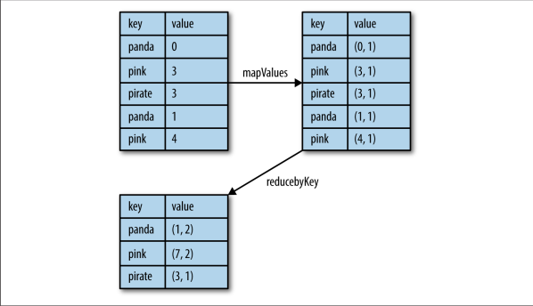
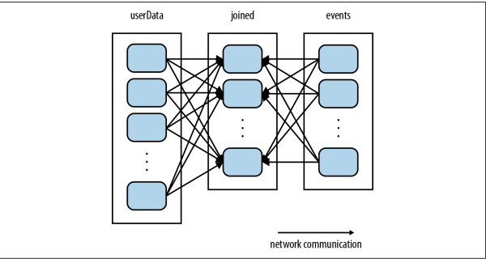
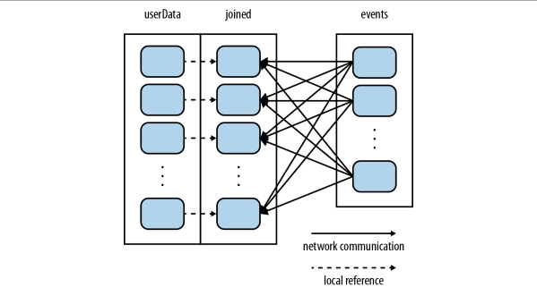

键值对RDD是Spark中许多操作所需要的常见数据类型。本章就来介绍如何操作键值对RDD。键值对RDD通常用来进行聚合计算。一般要先通过一些初始 ETL（抽取、转化、装载）操作来将数据转化为键值对形式。

## Motivation
Spark为包含键值对类型的 RDD 提供了一些专有的操作。这些RDD被称为pair RDD,PairRdd是很多程序的构成要素，因为它们提供了并行操作各个键或跨节点重新进行数据分组的操作接口。

### 创建pair Rdd

构建键值对 RDD 的方法在不同的语言中会有所不同。在 Python 中，为了让提取键之后的数据能够在函数中使用，需要返回一个由二元组组成的 RDD。

-   python 中的使用,文本行组成的 RDD 转换为以每行的第一个单词为键的 pair RDD
~~~python
lines=sc.textFile("README.md")  
pairs = lines.map(lambda x: (x.split(" ")[0], x))
~~~

-   scala中使用第一个单词作为键创建出一个pair RDD  
~~~scala
val pairs = lines.map(x => (x.split(" ")(0), x))
~~~

### 在pair rdd上使用translation函数
Pair RDD 可以使用所有标准RDD上的可用的转化操作，由于pair RDD中包含二元组，所以需要传递的函数应当操作二元组而不是独立的元素。

-   Pair RDD的转化操作（以键值对集合{(1, 2), (3, 4), (3, 6)}为例）

|函数|目的|示例|结果|
|-----|-----|-----|------|
|reduceByKey(func)|合并具有相同键的值|rdd.reduceByKey((x, y) => x + y)|{(1,2), (3,10)}|
|groupByKey()|对具有相同键的值进行分组|rdd.groupByKey()|{(1,[2]),(3, [4,6])}|
|combineByKey(createCombiner,mergeValue,mergeCombiners,partitioner)|使用不同的返回类型合并具有相同键的值||
|mapValues(func)|对pair RDD中的每个值应用一个函数而不改变键|rdd.mapValues(x => x+1)|{(1,3), (3,5), (3,7)}|
|flatMapValues(func)|对pairRDD中的每个值应用一个返回迭代器的函数,然后对返回的每个元素都生成一个对应原键的键值对记录,通常用于符号化|rdd.flatMapValues(x => (x to 5))|{(1,2),(1,3),(1,4),(1,5),(3,4),(3,5)}|
|keys()|返回一个仅包含键的RDD|rdd.keys()|{1,3,3}|
|values()|返回一个仅包含值的 RDD|rdd.values()|{2,4,6}
|sortByKey()|返回一个根据键排序的RDD|rdd.sortByKey()|{(1,2),(3,4),(3,6)}|

-   针对两个pair RDD的转化操作（rdd = {(1, 2), (3, 4), (3, 6)}other = {(3, 9)}）

|函数|目的|示例|结果|
|-----|-----|-----|------|
|subtractByKey|删掉RDD中键与other RDD中的键相同的元素|rdd.subtractByKey(other)|{(1, 2)}|
|join|对两个RDD进行内连接|rdd.join(other)|{(3, (4, 9)),(3,(6, 9))}|
|rightOuterJoin|对两个 RDD 进行连接操作，确保第一个RDD的键必须存在（右外连接）|rdd.rightOuterJoin(other)|{(3,(Some(4),9)),(3,(Some(6),9))}|
|leftOuterJoin|对两个RDD进行连接操作，确保第二个RDD的键必须存在（左外连接）|rdd.leftOuterJoin(other)|{(1,(2,None)),(3(4,Some(9))),(3,(6,Some(9)))}|
|cogroup|将两个 RDD 中拥有相同键的数据分组到一起|rdd.cogroup(other)|{(1,([2],[])),(3([4, 6],[9]))}|

## pair Rdd上的translation操作说明

### 聚合操作

pair RDD上则有相应的针对键的转化操作。 Spark 有一组类似的操作，可以组合具有相同键的值。这些操作返回RDD，因此它们是转化操作而不是行动操作

-   Python 中使用 reduceByKey() 和 mapValues() 计算每个键对应的平均值
~~~python
rdd.mapValues(lambda x: (x, 1)).reduceByKey(lambda x, y: (x[0] + y[0], x[1] + y[1]))
~~~
具体的计算过程如下图：

-   用Python实现单词计数
~~~python
rdd = sc.textFile("hdfs://...")
words = rdd.flatMap(lambda x: x.split(" "))
result = words.map(lambda x: (x, 1)).reduceByKey(lambda x,y:x + y)
~~~

-   使用combineByKey(createCombiner,mergeValue,mergeCombiners,partitioner)函数
combineByKey()是最为常用的基于键进行聚合的函数。大多数基于键聚合的函数都是用它实现的。和aggregate()一样，combineByKey()可以让用户返回与输入数据的类型不同的返回值
要理解combineByKey()，要先理解它在处理数据时是如何处理每个元素的。由于combineByKey()会遍历分区中的所有元素，因此每个元素的键要么还没有遇到过，要么就和之前的某个元素的键相同
combineByKey() 有多个参数分别对应聚合操作的各个阶段，因而非常适合用来解释聚合操作各个阶段的功能划分。
    -   这是一个新的元素， combineByKey() 会使用一个叫作 createCombiner() 的函数来创建那个键对应的累加器的初始值
    -   在处理当前分区之前已经遇到的键， 它会使用 mergeValue() 方法将该键的累加器对应的当前值与这个新的值进行合并
    -   如果有两个或者更多的分区都有对应同一个键的累加器， 就需要使用用户提供的 mergeCombiners() 方法将各个分区的结果进行合并

~~~python
sumCount = nums.combineByKey((lambda x: (x,1)),
                             (lambda x, y: (x[0] + y, x[1] + 1)),
                             (lambda x, y: (x[0] + y[0], x[1] + y[1])))
sumCount.map(lambda key, xy: (key, xy[0]/xy[1])).collectAsMap()
~~~

### 调整并行度级别

每个RDD都有固定数目的分区，分区数决定了在 RDD 上执行操作时的并行度。在执行聚合或分组操作时， 可以要求 Spark 使用给定的分区数。 Spark 始终尝试根据集群的大小推断出一个有意义的默认值， 但是有时候你可能要对并行度进行调优来获取更好的性能表现,本章讨论的大多数操作符都能接收第二个参数，这个参数用来指定分组结果或聚合结果的RDD的分区数。

-   在 Python 中自定义reduceByKey()的并行度

~~~python
data = [("a", 3), ("b", 4), ("a", 1)]
sc.parallelize(data).reduceByKey(lambda x, y: x + y)     # 默认并行度
sc.parallelize(data).reduceByKey(lambda x, y: x + y, 10) # 自定义并行度
~~~

有时，希望在除分组操作和聚合操作之外的操作中也能改变RDD的分区。对于这样的情况，Spark提供了repartition()函数。它会把数据通过网络进行混洗，并创建出新的分区集合。

### 数据分组

如果数据已经以预期的方式提取了键， groupByKey() 就会使用 RDD 中的键来对数据进行分组,**groupBy()**可以用于未成对的数据上，也可以根据除键相同以外的条件进行分组。
它可以接收一个函数，对源RDD中的每个元素使用该函数，将返回结果作为键再进行分组。

## pair Rdd上的action操作说明

和转化操作一样，所有基础RDD支持的传统行动操作也都在pair RDD上可用。Pair RDD提供了一些额外的行动操作，可以让我们充分利用数据的键值对特性。

-   Pair RDD的行动操作（以键值对集合{(1, 2), (3, 4), (3, 6)}为例）

|函数|目的|示例|结果|
|-----|-----|-----|------|
|countByKey()|对每个键对应的元素分别计数|rdd.countByKey()|{(1, 1), (3, 2)}|
|collectAsMap()|将结果以映射表的形式返回,以便查询|rdd.collectAsMap()|Map{(1, 2),(3,4),(3, 6)}|
|lookup(key)|返回给定键对应的所有值|rdd.lookup(3)|[4, 6]|

## 数据分区

分布式程序中，通信的代价是很大的， 因此控制数据分布以获得最少的网络传输可以极大地提升整体性能。和单节点的程序需要为记录集合选择合适的数据结构一样， Spark 程序可以通过控制RDD 分区方式来减少通信开销。 分区并不是对所有应用都有好处的——比如，如果给定RDD只需要被扫描一次，我们完全没有必要对其预先进行分区处理。只有当数据集多次在诸如连接这种基于键的操作中使用时，分区才会有帮助

-   示例代码
~~~scala
val sc = new SparkContext(...)
val userData = sc.sequenceFile[UserID, UserInfo]("hdfs://...").persist()

def processNewLogs(logFileName: String) {
    val events = sc.sequenceFile[UserID, LinkInfo](logFileName)
    val joined = userData.join(events)// RDD of (UserID, (UserInfo, LinkInfo)) pairs
    val offTopicVisits = joined.filter { case (userId, (userInfo, linkInfo)) => !userInfo.topics.contains(linkInfo.topic) // Expand the tuple into its components  
    }.count()
    println("Number of visits to non-subscribed topics: " + offTopicVisits)
}
~~~

-   partitioning 优化

~~~scala
val sc = new SparkContext(...)
val userData = sc.sequenceFile[UserID, UserInfo]("hdfs://...").partitionBy(new HashPartitioner(100)).persist() // Create 100 partitions
~~~

