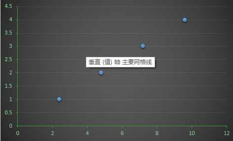

### 变量的类型

* 类别数据（定性数据）
  数据被划分为各种类别，用以描述某类的性质户特征，因此也称为定性数据。对于类别数据不要将其理解为数字。（如甜品的种类）。

* 数值数据（定量数据）
  数值型数据具有数字的意义，还涉及计量或计数（如长度和时间）。

### 算法举例

线性回归的总体目标是预测直线通过数据, 使每个点的垂直距离是最小的到该预测线。以下通过计算材料电阻的方法进行说明。
电阻公式 ：R=ρL/S (ρ导体材料的电阻率,L为导体的长度,S为导体的横截面积)

有不同长的的材料，其横截面相同，对一些已知长度的材料其电阻值已经，通过这些信息，计算其他任意长度的材料的电阻值。

|编号|材料长度|电阻值|
|----|-----|-----|
|1|1|2.4|
|2|2|4.9|
|3|3|7.3|
|4|4|9.1|

* squared errors - 均方误差    
是反映估计量与被估计量之间差异程度的一种度量

* 协方差（Covariance）   
在概率论和统计学中用于衡量两个变量的总体误差。而方差是协方差的一种特殊情况，即当两个变量是相同的情况

协方差表示的是两个变量的总体的误差，这与只表示一个变量误差的方差不同。 如果两个变量的变化趋势一致，也就是说如果其中一个大于自身的期望值，另外一个也大于自身的期望值，那么两个变量之间的协方差就是正值。 如果两个变量的变化趋势相反，即其中一个大于自身的期望值，另外一个却小于自身的期望值，那么两个变量之间的协方差就是负值。

* TSS , SSE , SSR 

  TSS = SSE + SSR 
  TSS  -  Total Sum of Squared Errors  平方误差的总和   -   使用均值进行计算。    
  SSE  -  Sum of squared errors        平方误差之和     -   计算得到斜率公式，重新计算需要预测的值。     
  SSR  -  Residual Sum of squared errors  平方误差的剩余总和      

  SSR / TSS  计算求得 确定系数，越大，说明预测的准确率越高。     

-   计算过程
    * 求斜率和截距 （通过均值代理计算）- 通过协方差进行计算 
    * 计算确定系数，用来评估准确性。

### 实际代码

~~~python
#创建Sparksession对象
from pyspark.sql import SparkSession
spark=SparkSession.builder.appName('lin_reg').getOrCreate()

#从MLlib库中导出线性回归算法
from pyspark.ml.regression import LinearRegression

#装载数据
df=spark.read.csv('线性回归-LinearRegression/Linear_regression_dataset.csv',inferSchema=True,header=True)

#确认数据量大小
print((df.count(), len(df.columns)))

df.printSchema()

# 查看数据统计特征
df.describe().show(5,False)

# 计算数据方差
from pyspark.sql.functions import corr

df.select(corr('var_1','output')).show()

~~~
