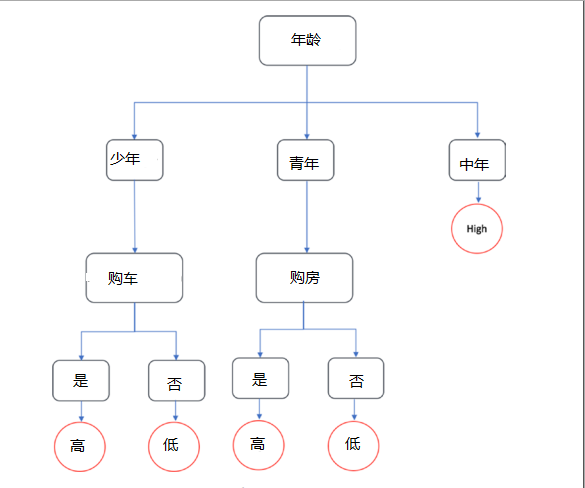
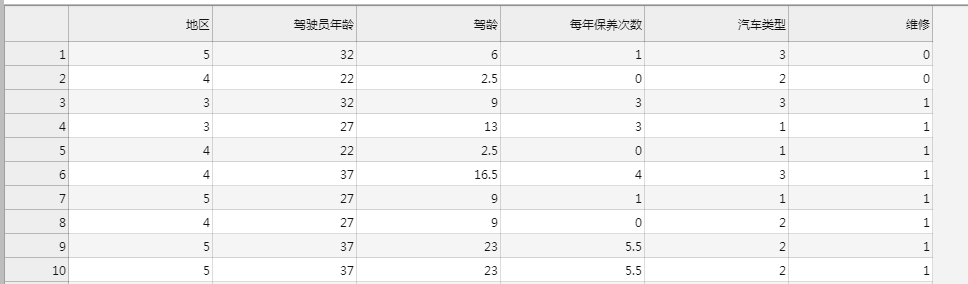
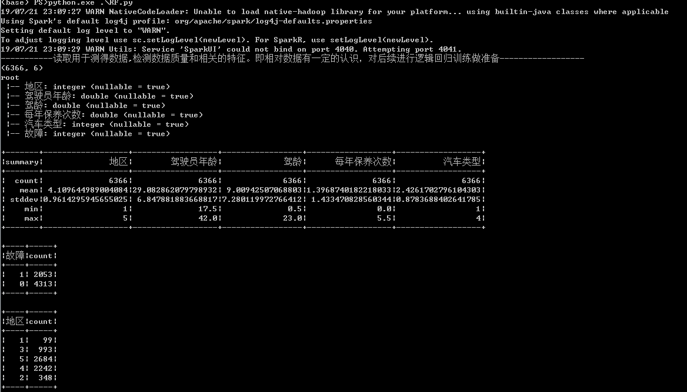
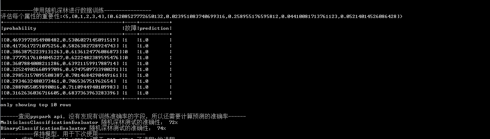

## 信息熵-熵的计算

* 信息熵：常被用来作为一个系统的信息含量的量化指标，从而可以进一步用来作为系统方程优化的目标或者参数选择的判据,
         可以作为一个系统复杂程度的度量，如果系统越复杂，出现不同情况的种类越多，那么他的信息熵是比较大的。

* 信息熵的三个性质
  * 单调性，即发生概率越高的事件，其所携带的信息熵越低
  * 非负性，即信息熵不能为负
  * 累加性，即多随机事件同时发生存在的总不确定性的量度是可以表示为各事件不确定性的量度的和

可以发现,上述的公式中计算是相当与 将所有的期望值相加了。

设想：在一个封闭系统的盒子中，其中有各种的信息源，这些信息源间，可能相互关联，或彼此独立。现在从这个盒子外部看接受信息。

     对于单调性 ： 如果 盒子中只有一个数据源，每次都可以确定信息，这样对应的必然事件，对应的概率是1，对于熵值为0 。

     累加性：如果盒子中有很多数据源，两个独立数据源发生时的概率：P(A)*P(B) ；两个关联事件发生的条件概率为 P(A|B) = P(A∩B)/P(B)
            可以发现需要间概率计算中的乘除转为为可以进行累加，所以使用对数进行处理，这样可以将概率计算中的乘除化解为加减。
      
结合概率统计中概率计算      
[概率计算及相关]{https://blue-shadow.top/2019/02/06/4%E6%A6%82%E7%8E%87%E8%AE%A1%E7%AE%97/}

## 决策树-Decision Tree

**由于随机森林是由很多的决策树构成的，所以在使用随机森林模型前，先了解决策树中的构建过程，有助于对随机森林的学习**

* 使用如下测试表中的数据来说明：

|年龄段	|是否购车	|是否购房	|薪资水平	|贷款额度|
|-----|-----|-----|-----|-----|
|中年	|是	|是	|高	|高|
|少年	|是	|是	|中等|高|
|青年	|是	|是	|中等|低|
|中年	|否	|是	|高	|高|
|青年	|是	|是	|高	|低|
|少年	|否	|是	|低	|高|
|少年	|否	|否	|低	|低|
|中年	|否	|否	|低	|高|
|少年	|否	|是	|中等|高|
|青年	|否	|是	|低	|高|
|青年	|是	|否	|高	|低|
|少年	|是	|否	|中等|低|
|青年	|否	|否	|中等|高|
|中年	|是	|否	|中等|高|

* 对于决策树的计算中，需要使用到熵

为了能够计算目标变量-贷款额度，需要计算每类的概率，然后使用熵公式进行计算。

~~~
高贷款额度概率 : 9/14 = 0.64
低贷款额度概率 ：5/14 = 0.36

所以 熵值为 ： E(贷款额度) = - P(高贷款额度) * log(2)(P(高贷款额度))  - P(低贷款额度) * log(2)(P(低贷款额度))  
                = -( 0.64 * log(2)(0.64)) - (0.36 * log(2)(0.36))
                = -( 0.64 * -0.643856 ) - (0.36 * -1.473931)
                = 0.41206784 + 0.53061516
                = 0.94
~~~

用同样的方式，计算各个特征的熵值： E(年龄) = 0.69 ; E(购车) = 0.79 ; E(购房) = 0.89 ; E(薪资) = 0.91 

* 信息增益

在信息增益中，衡量标准是看特征能够为分类系统带来多少信息，带来的信息越多，该特征越重要。对一个特征而言，系统有它和没它时信息量将发生变化，而前后信息量的差值就是这个特征给系统带来的信息量。

~~~
IG(年龄段) = E(贷款额度) - E(年龄段)
          = 0.94 - 0.69
          = 0.25

IG(购车)  = E(贷款额度) - E(购车) 
          = 0.94 - 0.79
          = 0.15

IG(购房)  = E(贷款额度) - E(购房) 
          = 0.94 - 0.89
          = 0.05

IG(薪资)  = E(贷款额度) - E(薪资) 
          = 0.94 - 0.91
          = 0.03
~~~

通过求解信息增益量，可以发现年龄信息增益量最大，所以其作为决策树的root

所以最后的决策树样子应该是这样的:

## 随机森林

知道决策树是如何工作的后,可以转向随机森林。正如名字所暗示的,随机森林是由许多树组成的,许多决策树。
随机森林也可以用于分类和回归。名字“随机”的原因是,因为树的形成是随机的，集合的特性和随机的训练。现在每个
决策树接受不同数据点的训练试图学习输入和输出之间的关系,最终实现了这一点与其他使用其他决策树的预测相结合
一组数据点被训练,因此是随机森林。

**测试用数据**

## 示例代码

~~~python
from pyspark.sql import SparkSession
spark=SparkSession.builder.appName('random_forest').getOrCreate()

print('-----------读取用于测得数据,检测数据质量和相关的特征。即相对数据有一定的认识，对后续进行逻辑回归训练做准备------------------')

# 读取数据
df=spark.read.csv('cars.csv',inferSchema=True,header=True)

print((df.count(),len(df.columns)))

df.printSchema()

df.describe().select('summary','地区','驾驶员年龄','驾龄','每年保养次数','汽车类型').show() # 全景数据分析统计，会对各列按 平均值，方差，最小值，最大值 , 函数统计 这几个统计量来进行统计。
df.groupBy('故障').count().show()                                                        # 以故障汇总数据
df.groupBy('地区').count().show()                                                        # 以所在地进行汇总数据 
df.groupBy('汽车类型','故障').count().orderBy('汽车类型','故障','count',ascending=True).show()  

df.groupBy('每年保养次数','故障').count().orderBy('每年保养次数','故障','count',ascending=True).show()

df.groupBy('故障').mean().show()                                                        # 计算均值

print('-----------数据转换，将所有的特征值放到一个特征向量中，预测值分开.划分数据用于模型------------------')

from pyspark.ml.feature import VectorAssembler                                         #一个 导入VerctorAssembler 将多个列合并成向量列的特征转换器,即将表中各列用一个类似list表示，输出预测列为单独一列。

df_assembler = VectorAssembler(inputCols=['地区', '驾驶员年龄', '驾龄', '每年保养次数', '汽车类型'], outputCol="features")
df = df_assembler.transform(df)
df.printSchema()

df.select(['features','故障']).show(10,False)

model_df=df.select(['features','故障'])                                               # 选择用于模型训练的数据
train_df,test_df=model_df.randomSplit([0.75,0.25])                                    # 训练数据和测试数据分为75%和25%

train_df.groupBy('故障').count().show()
test_df.groupBy('故障').count().show()

print('-----------使用随机深林进行数据训练----------------')

from pyspark.ml.classification import RandomForestClassifier

rf_classifier=RandomForestClassifier(labelCol='故障',numTrees=50).fit(train_df)      # numTrees设置随机数的数量为50,还有其他参数：maxDepth 树深;返回的模型类型为：RandomForestClassificationModel

rf_predictions=rf_classifier.transform(test_df)

print('{}{}'.format('评估每个属性的重要性:',rf_classifier.featureImportances))   # featureImportances : 评估每个功能的重要性,

rf_predictions.select(['probability','故障','prediction']).show(10,False)

print("------查阅pyspark api，没有发现有训练准确率的字段，所以还需要计算预测的准确率------")

from pyspark.ml.evaluation import BinaryClassificationEvaluator      # 对二进制分类的评估器,它期望两个输入列:原始预测值和标签
from pyspark.ml.evaluation import MulticlassClassificationEvaluator  # 多类分类的评估器,它期望两个输入列:预测和标签

rf_accuracy=MulticlassClassificationEvaluator(labelCol='故障',metricName='accuracy').evaluate(rf_predictions)
print('MulticlassClassificationEvaluator 随机深林测试的准确性： {0:.0%}'.format(rf_accuracy))

rf_auc=BinaryClassificationEvaluator(labelCol='故障').evaluate(rf_predictions)
print('BinaryClassificationEvaluator 随机深林测试的准确性： {0:.0%}'.format(rf_auc))

print('-----------保持模型，用于下次使用----------------')

rf_classifier.save("RF_model")
~~~

